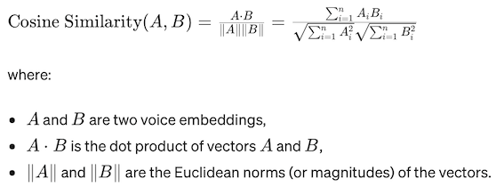
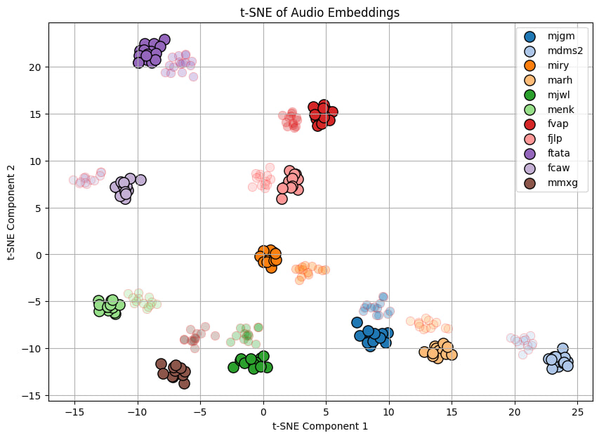
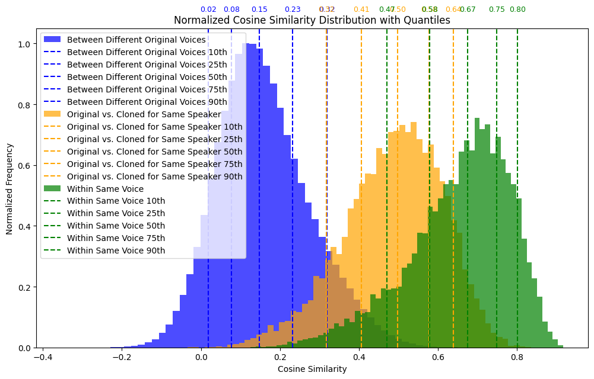

# Speaker Recognition and Clone Detection Toolkit

The advanced analysis of voice data, encompassing voice cloning, embedding extraction, and the use of cosine similarity for voice verification. 
It enables the differentiation between original and cloned voices, as well as the verification of speaker identity, leveraging state-of-the-art machine learning techniques.

## Table of Contents
- [Basic Concepts](#basic-concepts)
  - [Voice Embeddings](#voice-embeddings)
  - [Cosine Similarity](#cosine-similarity)
  - [Voice Cloning](#voice-clonning)
- [Implementation](#implementation)
- [Requirements](#requirements)
- [Quick Start](#quick-start)

## Basic Concepts
The toolkit comprises three main components: voice cloning using a Text-to-Speech (TTS) API, extraction of voice embeddings, and analysis of these embeddings through cosine similarity. 
This multi-faceted approach facilitates a thorough examination of voice data, providing essential tools for speaker verification and the study of voice cloning technologies.
### Voice Embeddings
Voice embeddings are obtained by feeding voice recordings into the deep neural network, which outputs a vector in a high-dimensional space. Each dimension represents a learned feature of the voice, capturing unique characteristics of the speaker.
**Model:** We utilize NVIDIA's NeMo toolkit, specifically the **nvidia/speakerverification_en_titanet_large model**, for extracting voice embeddings. This pre-trained model is designed for speaker verification tasks and generates a high-dimensional vector representation for each voice sample.
### Cosine Similarity
Cosine similarity measures the cosine of the angle between two non-zero vectors in a multi-dimensional space, offering a metric for assessing the similarity between two voice embeddings. It is defined as follows:

### Voice Cloning
Voice cloning is a technology that enables the creation of synthetic speech that closely mimics a target speaker's voice. This involves analyzing the acoustic characteristics of the target voice from audio samples and then using this analysis to generate new speech that sounds like it was spoken by the target speaker.
**Model:** We utilize **NVIDIA's TTS (Text-to-Speech) system** for our voice cloning process. This advanced model is designed to generate highly realistic and natural-sounding speech that closely mimics the target speaker's voice characteristics, offering a seamless cloning effect.
## Implementation
### Visualisation of Clusters
The computations were carried out on the **AN4 dataset from Nvidia**, which contains over ten voice samples for each speaker and more than 100 distinct voices. We visually confirmed the clustering of embeddings by employing **the dimensionality reduction method t-SNE**. For ease of visual interpretation, the accompanying figure presents a visualization of 11 randomly selected samples from the AN4 dataset along with their clones. Original samples are depicted in vibrant colors, while their clones are represented in the same, albeit paler, colors:

### Tresholds Determination
To determine the thresholds, we constructed distributions of cosine similarities within voice samples from the same individual, between voice samples from different individuals, and between samples of real voices and their clones. This process yielded a probability distribution and thresholds for distinguishing between voices of different individuals and between real and cloned voices:

